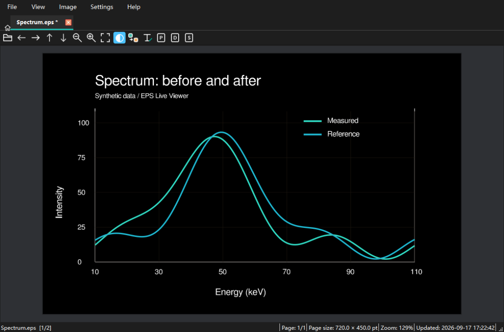
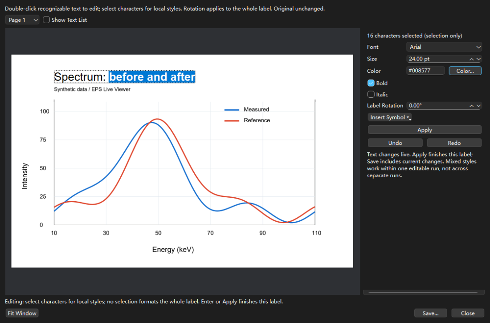
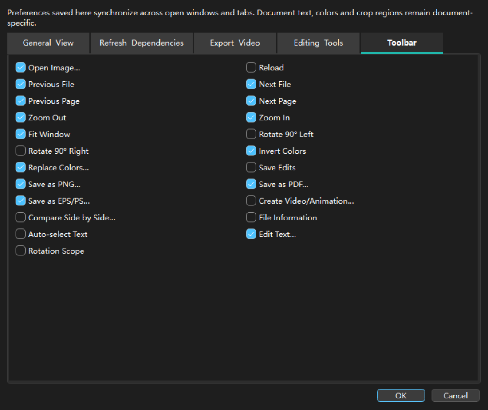

# EPS Live Viewer

[中文](README.md) | [English](README_EN.md)

当前版本：**3.1.0**。

**1.0：浏览与实时刷新 → 2.0：换色、比较与导出扩展 → 3.0：可识别文字的轻量编辑。**

<table>
<tr><td width="33%"></td><td width="33%"></td><td width="33%"></td></tr>
<tr><td>反色与换色</td><td>页面内编辑文字</td><td>自定义工具栏</td></tr>
</table>

小图可点击放大；截图来自实际界面，使用合成演示数据。

3.0 增加可识别文字的轻量编辑、品牌首页、简约图标工具栏和文档颜色选择。保留完整帧预览及有上限的高清缓存，不增加大型编辑引擎或字体包。

**EPS Live Viewer supports lightweight editing of recognizable PostScript text objects.**

## 快速修改科研图文字

打开 EPS/PS 后，选择 **图像 → 编辑文字…**（或 `Ctrl+Shift+T`、工具栏文字图标）。在可调整大小、可最大化的独立窗口中：

1. 双击页面上的可识别文字，直接在页面中输入、删除、拖选字符。识别列表默认隐藏，可在设置或编辑窗口中显示。
2. 选中片段内的几个字符，再改字体、字号、颜色、粗体或斜体；没有选区时对整段应用。旋转始终作用于整段。符号工具盒以分类网格提供希腊字母和科研符号。
3. 修改实时显示，可撤销、重做；Enter 或“应用”结束当前片段。“保存”也包含尚未点击应用的修改，格式顺序为 EPS、PS、PDF。

局部样式仅适用于同一可编辑片段内部，不跨独立片段排版；默认自动选择文本开启时，主预览双击文字可直达编辑，双击空白仍恢复 100%。不能识别的文字会明确提示，不进行猜测替换。

**原文件不会被覆盖**。PDF/PS 保存全部页面，EPS 保存当前页。输出是真正的矢量文档，不是编辑记录文件；EPS/PS 会由 Ghostscript 重新生成，不保留原始 PostScript 程序结构。编辑期间使用独立快照；原文件被外部程序更新时，另存为前会提示。

首版只承诺可可靠识别的独立文字片段，不提供 OCR、公式重排或任意对象编辑。转曲、复杂组合文字、特殊编码、裁剪文字、共享 Form 内文字等可能不可编辑；“可复制”不一定意味着“可编辑”。本工具新生成的 PDF 文字支持再次打开编辑。旧版 Ghostscript 导出 EPS/PS 时可能将新文字转为矢量轮廓，届时无法再次直接编辑；建议同时保留编辑后的 PDF。

字体来自本机，不捆绑 Arial、Times New Roman 或大型中文字体包；缺字会提示，请选择包含相应字符的字体。不同系统可用字体不同，嵌入字体需遵守其许可。

## 首页、设置与选色

首页以表格显示最近打开文件的名称、大小、最近打开时间和位置，双击即可打开，也可在设置中隐藏。关闭最后一个文件标签返回首页；窗口关闭按钮或“文件 → 退出”才退出软件。首次窗口大小适应当前屏幕，也可选择启动最大化。

菜单栏位于标签栏上方。标签栏最左侧只保留一个与文档标签等高的 Home 图标，可随时返回首页，不会重复创建首页标签。菜单始终显示 **Settings → 界面语言 / Language…**，无需先看懂当前语言。

EPS 导出保留页面画布及留白，不再随图形内容收紧边界。旋转标签和有明确独立位置的单位、上标片段可进入编辑；悬停可编辑文字时显示输入光标。阅读只需找到文字位置，编辑还必须能安全分离原文字对象，因此可复制的文字仍不一定可编辑。

在 Settings 的“导出与视频”中预设复杂效果的备用 DPI；矢量导出不再弹窗询问。此参数不将普通文字和线条强制位图化。覆盖文件、未保存修改和源文件冲突等防止丢失数据的确认仍保留。

**设置菜单**集中提供常规与预览、刷新与依赖、导出与视频、编辑与工具、工具栏五个区块。这里保存的偏好同步到所有窗口/标签页，优先于此前的工具偏好；具体文字、配色规则、旋转结果和裁剪区域仍归各文档独立所有。视频窗口中的本次任务参数不会改写全局默认值；PNG/JPG 序列仍优先使用首帧尺寸。

未打开文件时显示品牌、主要功能、版本、仓库与作者邮箱，可直接打开或拖入文件。工具栏以图标显示，悬停显示全称；仍可自定义显示项目。文字编辑默认出现在新配置的工具栏中，已有自定义配置不会被覆盖。

颜色替换条目用实际颜色显示色值。选色器提供当前页可识别绘制色和单独标注的预览采样色，也保留任意 RGB/HEX 选色。源色按反色之后、替换之前显示；目标色提供原始颜色。采样可能含抗锯齿过渡色，并非完整的原始颜色清单。

缺少 Ghostscript 时提供下载链接及路径设置入口，可关闭重复安装指引；操作失败仍会提示。

EPS Live Viewer 是面向科研绘图快速迭代的轻量级跨平台桌面查看器。它能实时查看 EPS/PS/PDF，也能直接打开 PNG/JPG，在同一个界面中完成相邻文件比较、多页浏览、旋转、反色、替换颜色、图片导出和视频制作。

## 主要功能

- EPS/PS/PDF 矢量预览：放大时按当前可见区域重新渲染，完整画面一次更新；高清缓存有像素上限，不累计保存多档缩放图像。PDF 阅读无需 Ghostscript。
- PNG/JPG 图片查看：无需 Ghostscript 即可打开、缩放、旋转、反色和替换颜色。
- 实时刷新：当前文件被 IDL、Python、MATLAB、Fortran 等程序重新生成后自动更新。
- 快速比较：自动识别同一文件夹中的 EPS、PS、PDF、PNG、JPG/JPEG；`←`、`→` 切换相邻文件。
- 多页文档：`↑`、`↓` 切换 EPS/PS/PDF 页面；滚轮行为可设置为缩放、相邻文件或翻页，`Ctrl + 滚轮` 始终缩放。
- 图像调整：“图像”菜单支持左/右旋转，可选择“仅当前页”或“全部页面”；支持全文档反转颜色，以及最多 16 组颜色替换。
- 简洁工具栏：默认隐藏重新加载和旋转工具；通过“查看 → 自定义工具栏”或右键工具栏选择需要显示的工具。新配置默认白色背景，已有自定义背景保留。
- 独立标签页：设置中可选新窗口（默认）或同一窗口的新标签页，支持双击文件打开；各标签页分别保留缩放、旋转、配色和导出任务，全局偏好统一同步。
- 保存编辑：`Ctrl+S` 保存旋转和配色记录，关闭未保存的文件时询问保存、放弃或取消。原文件保持不变。
- 文件信息与文本：文件菜单可查看路径、大小、页数和尺寸；EPS/PS/PDF 默认在文字处拖选复制，空白处拖动平移。
- 灵活配色：颜色窗口支持 RGB 和 HEX 色值；系统提供时可使用屏幕取色器。可为每组替换设置 RGB 容差。处理顺序固定为“反色 → 颜色替换”，因此点击顺序不会改变结果。
- 撤销／重做：`Ctrl+Z` 撤销、`Ctrl+Y` 或 `Ctrl+Shift+Z` 重做图像调整；每个文件分别保留最近 50 次历史，自动刷新不会清除历史。
- 实时调色预览：编辑颜色和容差时后台更新预览，按住“查看原图”对照原始配色；确定后应用，取消不改动当前文件的调整。
- 双图并排比较：固定左侧参考图，右侧可另选文件、切换页面或跟随主窗口；可联动缩放和平移。
- PNG 导出：可设置 72–600 DPI；多页 EPS/PS/PDF 可仅保存当前页，或将全部页面导出到一个新文件夹。调色优先在矢量对象上完成再抗锯齿渲染，减少边缘杂色；在像素预算允许时对低至中 DPI 输出进行超采样。
- 文档导出：调整后的结果可保存为 PDF、PS 或 EPS。PDF/PS 保留多页，标准 EPS 保存当前页。
- 视频/动图：文件夹中的每个 EPS/PS/PDF 页面和每张 PNG/JPG 都可作为独立帧，支持调整顺序、排除帧、按首帧设置画布、比例裁剪、帧率、MP4/GIF，并应用已设置的旋转与颜色调整。
- 视频试播：显示预计时长，可在正式生成前低分辨率播放、暂停、拖动进度并循环检查；不会覆盖输出视频。
- 手动诊断：查看并复制版本、当前页及旋转配色状态、最近错误，报告不会自动上传。
- 中英文界面、最近文件、背景颜色、手动检查 GitHub 更新。

查看器使用文件自身的页面或图像尺寸，并不限制为 A4，因此无需设置纸张大小。PNG/JPG 本身是位图，放大清晰度仍由原始像素决定。

## 安装

从 [GitHub Releases](https://github.com/eternitylzt/EPSLiveViewer/releases) 下载对应平台：

- Windows：解压 `EPSLiveViewer-Windows-x64.zip`，运行 `EPSLiveViewer.exe`。
- macOS Apple Silicon：下载 `EPSLiveViewer-macOS-arm64.dmg`。
- macOS Intel：下载 `EPSLiveViewer-macOS-x64.dmg`。
- Linux x64：解压 `EPSLiveViewer-Linux-x64.tar.gz`，为程序添加执行权限后运行。

发布包无需 Python。读取 EPS/PS 或导出为 EPS/PS 需要 Ghostscript；程序会自动查找，也可在“文件 → 设置”中指定路径。阅读普通 PDF、打开 PNG/JPG、调色、PNG 导出及视频制作不需要 Ghostscript。普通 PDF 的矢量调色导出也无需 Ghostscript；遇到需要位图兼容处理的复杂 PDF 时，文档导出会明确提示安装 Ghostscript。

## 使用方法

1. 选择“文件 → 打开图片”，将文件拖入窗口，或在命令行传入文件路径。
2. 使用滚轮缩放、拖动平移、双击恢复 100%，或点击工具栏的缩放和适应窗口按钮。
3. 用方向键浏览相邻文件和多页文档；状态栏显示文件位置、页码、页面尺寸、缩放和更新时间。
4. 在“图像 → 旋转范围”中选择“仅当前页”或“全部页面”，再选择左/右旋转。需要时可把这些操作加入工具栏。范围设置仅影响之后的旋转操作。在“图像 → 替换颜色”中添加源颜色、目标颜色和容差；拖动中间分隔栏可调整编辑区与预览区宽度。
5. 选择“另存为 PNG/PDF/EPS/PS”导出独立成品，不需要携带编辑记录。常见文字、纯色线条与填充可在反色/替换颜色后保留矢量；复杂渐变、特殊色彩空间、注释等使用所选备用 DPI 导出位图页面。PDF/PS 保存多页，EPS 保存当前页。
6. 选择“文件 → 制作视频/动图”。EPS/PS/PDF 默认使用当前文件的全部页面，也可选择文件夹并筛选格式，再调整帧列表和输出参数。试播显示每帧的文件名与页码，裁剪、试播和视频使用与主窗口一致的页面及旋转。

新增功能入口：

- “图像 → 撤销／重做图像调整”可回退旋转、反色、替换颜色及重置操作；一次“全部页面”旋转只需撤销一次。
- “图像 → 替换颜色”：添加替换后直接编辑色值、点击“选色”输入 RGB 或调节容差，右侧会更新预览。“按住查看原图”仅临时显示原始配色，保留页面旋转。
- 制作视频窗口会显示帧数、FPS 和预计时长；“试播”使用当前选帧、顺序、裁剪和配色。试播为低分辨率近似预览，最终文件按选定画布生成。
- “查看 → 并排比较”（`Ctrl+Shift+C`）：左侧默认锁定参考图，右侧可选图或跟随主窗口；取消“联动缩放和平移”即可独立查看。联动使用相同缩放比例和页面相对位置。比较窗口里的选图不改变主窗口的当前文件。
- “帮助 → 诊断信息”：报告可预览和复制；错误窗口也提供详细信息。诊断仅在当前会话保留，可能含本地文件路径，请查看后再分享。

“文件 → 保存编辑记录”（`Ctrl+S`）把旋转、反色、颜色替换保存到源文件旁的 `原文件名.epslive.json`，下次打开自动恢复。移动文件时请一并移动这份记录；需要独立的成品图像仍使用“另存为 PNG/PDF/EPS/PS”。自动刷新保留当前编辑状态。

“Settings → 常规与预览 → 打开文件”可选择窗口或标签页。每个标签页独立保存文档编辑，即使打开的是同一文件；全局偏好修改同步到所有窗口和标签页。`Ctrl+W` 关闭当前文档标签，Home 不关闭。

并排比较窗口可以最大化。当前文档为多页时，右侧默认显示本文件的下一页，也可从下拉列表选择其它页；单页时可选已打开的标签页或“浏览”打开新图。

“查看 → 自动选择文本”默认对 EPS/PS/PDF 开启：鼠标在文字处显示文本光标，可拖选并按 `Ctrl+C` 复制；在空白处显示手形，直接拖动平移。关闭该选项后始终拖动平移。选区支持旋转后的页面。转成路径的字形、扫描图片不含可选文字，本工具不做 OCR，也不提供修改文字内容或移动 PDF 图形对象的编辑器。

视频裁剪预览和生成结果使用相同的旋转、配色顺序。重新打开制作窗口不会继续旋转已有预览。MP4 使用 H.264 Main / YUV420 编码；奇数宽高仅在右侧或底部补 1 像素，保留完整选区。GIF 保持原尺寸。

## 常见问题

### 为什么 EPS/PS 无法显示？

确认已安装 Ghostscript，并在设置中选择控制台程序：Windows 通常为 `gswin64c.exe`，Linux/macOS 通常为 `gs`。

### 为什么 PNG/JPG 放大后不再清晰？

PNG/JPG 是位图；程序不会凭空增加细节。EPS/PS 中原本嵌入的照片也受原始像素限制。

### 为什么矢量图放大后还需要短暂刷新？

屏幕显示仍需把矢量内容渲染为当前缩放比例的像素。2.3.1 在准备新画面时保留上一幅完整画面，随后一次更新，不再逐块替换。普通鼠标点击不会改变图像；透明背景设置中的棋盘格则是用于指示透明区域的正常显示。复杂图表仍可能需要短暂计算，预览内存也会随窗口大小和源文件复杂度变化。

### 视频像幻灯片一样逐张切换？

每张图片或每页对应一帧，播放时长为“帧数 ÷ FPS”。低帧率下逐张切换是正常的；希望切换更快可调高 FPS。v2.0.1 改进了 MP4 的播放器兼容性；旧版生成的视频需要重新导出。

### 替换颜色后的 PDF/EPS/PS 能保留矢量吗？

2.3.0 起，常见科研图表可直接修改文档中的绘制颜色，保留文字、线条和路径，而不是整页截图。复杂渐变、图案、特殊色彩空间、透明混合和注释等暂不承诺无损矢量调色，会使用备用 DPI 的位图兼容导出；嵌入照片不会变为矢量。PNG 和视频始终按像素输出。

### 600 DPI 导出为什么曾经卡住？

旧版逐像素 Python 处理较慢，且 600 DPI A4 图片可能超过 Qt 默认图片解码预算。新版使用分块原生运算与直接页面渲染，修复这两个瓶颈。为防止内存耗尽，单张输出仍限制为 6400 万像素、单边 30000 像素；超大页面请降低 DPI。提高 DPI 不能恢复原始位图中不存在的细节。

### PDF 是否需要安装新组件？

发布包已包含阅读与调色所需组件。EPS/PS 支持可识别文字的轻量编辑；PDF 当前不支持 OCR、文字编辑或移动图形对象，也不支持输入密码解锁受保护文件。PDF 文件较复杂时，个别效果会采用兼容位图导出。

### macOS 提示应用不安全怎么办？

正式签名和公证需要 Apple Developer 证书；如果当前 Release 未公证，可在 Finder 中按住 Control 点击应用并选择“打开”，或在“隐私与安全性”中确认打开。请只从本项目 Releases 下载。

### 为什么不能覆盖当前打开的源文件？

文档另存为会阻止覆盖当前源文件，避免自动刷新和导出同时破坏原图。请使用新的文件名。

### 如何检查更新？

手动选择“帮助 → 检查更新”。程序不会后台检查、自动下载或自动安装。

开发与构建信息

开发环境为 Python 3.11+、PyQt6、Ghostscript、PyInstaller。安装依赖后可运行 `python main.py example.eps`。Windows 运行 `build.bat` 生成单文件 EXE；Linux/macOS 使用 `build_unix.sh`。推送 `eps-live-viewer-v*` 标签会触发原生 Windows、Linux、macOS Apple Silicon/Intel 构建并创建 GitHub Release。

PDF 阅读复用已有 QtPdf；颜色计算使用精简打包的 Pillow 原生运算，矢量调色使用纯 Python 的 pypdf。不打包 Pillow 的 AVIF、WebP、字体或 Tk 组件，也不引入完整 PDF 编辑引擎。Ghostscript 仍是唯一的 EPS/PostScript 解释器。

试播使用 Qt 定时器和临时 PNG，不引入 QtMultimedia；内存最多缓存 8 张试播帧，关闭窗口后清理临时文件。颜色处理使用可取消的后台任务，过时的预览结果会丢弃。新增操作只保存小型状态记录，不复制原始文档到撤销历史。

作者：Zhentong Li · eternitylzt@gmail.com
